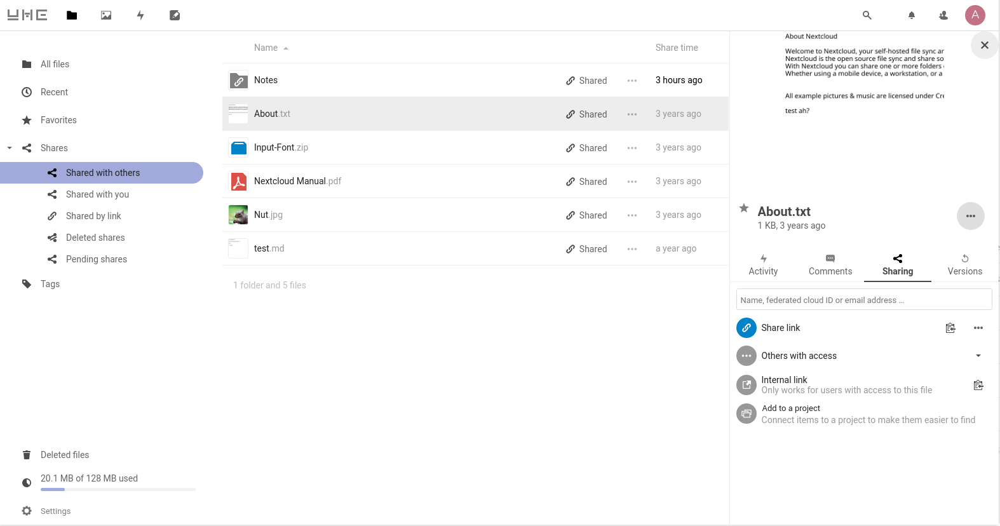
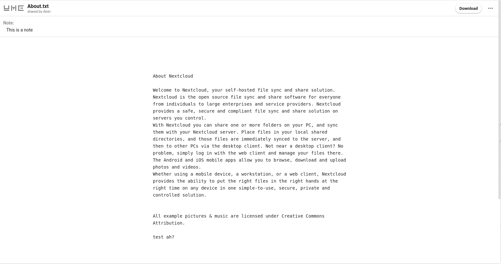
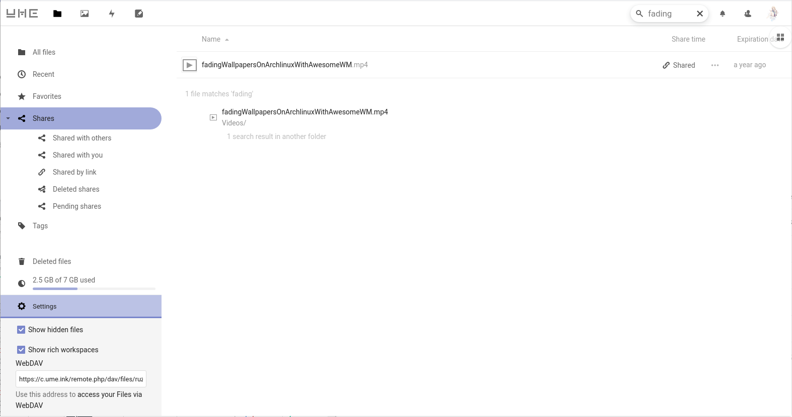
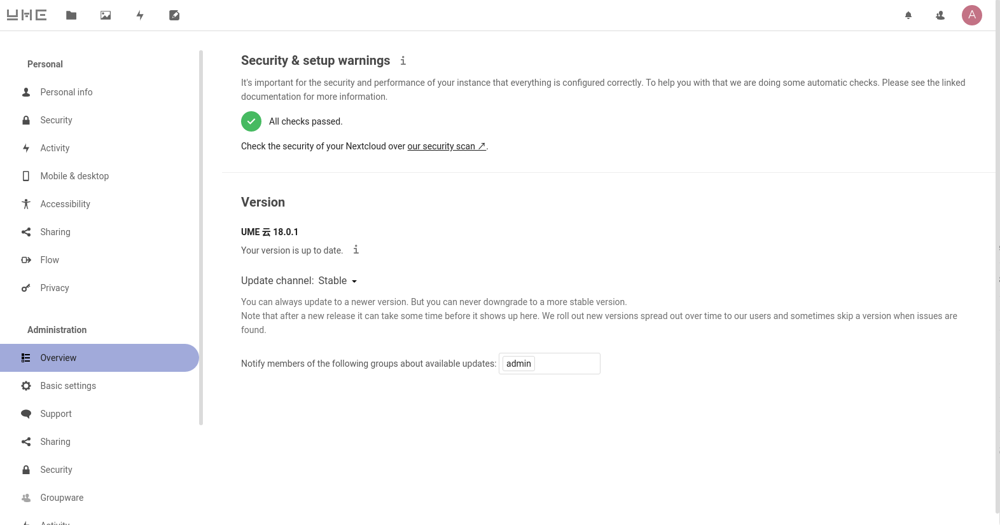

# UMECloudTheme - A theme for NextCloud 18.0.1

A simple theme for NextCloud, it's compatible with version 18.0.1

一个简单的 NextCloud 主题，与版本 18.0.1 兼容

**Easy to install**

1. enter the NextCloud theme directory:

```
$ cd /path/to/nextcloud/themes/
```

2. clone this repository to the current path:

```
$ git clone --branch master https://github.com/Bekcpear/UMECloudTheme.git
```

3. edit `./UMEThemeCloud/defaults.php` to do some personal settings

4. copy your own icons to overwrite corresponding icons in the `./UMEThemeCloud/core/img` directory

5. fix the permission of UMECloudTheme directory and all it's subdirectories and files

6. edit `/path/to/nextcloud/config/config.php` to set `'theme' => 'UMECloudTheme',` , and save it

7. run update theme command:

```
$ cd /path/to/nextcloud/
$ sudo -u <PHPFPM-USER> php occ maintenance:theme:update
```

8. refresh you NextCloud page (clean the cache at this time) and enjoy it *(if memcache used, you should restart the php-fpm service)*.

## Screenshots










## LICENSE

AGPL
