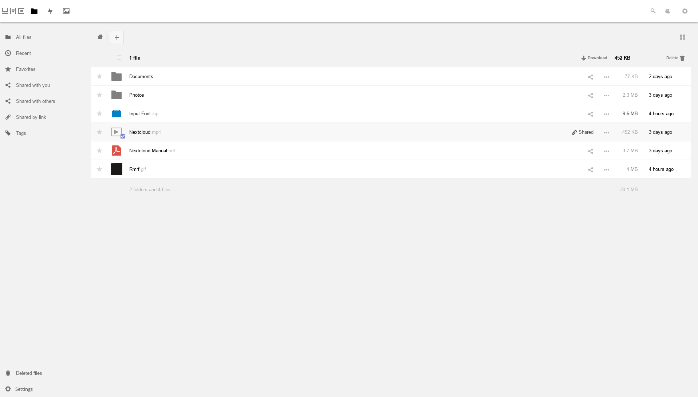
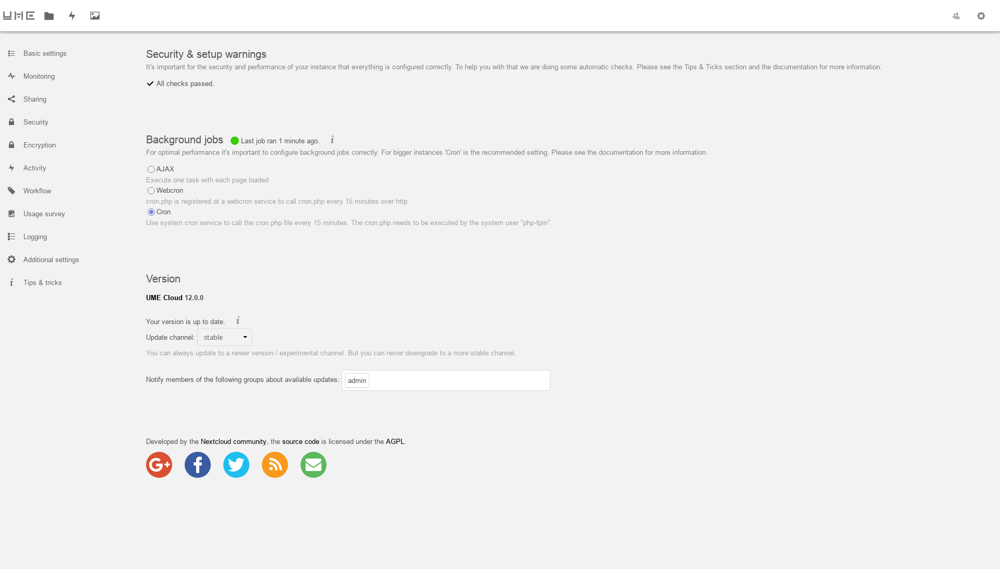

# UMECloudTheme - A theme for NextCloud 12.0.0

This is a theme for NextCloud, it's compatible with version 12.0.0

**It's easy to install**

1. change to your NextCloud theme directory:

```
$ cd /path/to/nextcloud/themes/
```

2. clone this repository to the current path (also need the `git` command):

```
$ git clone --branch master https://github.com/Bekcpear/UMECloudTheme.git
```

3. edit `/path/to/nextcloud/themes/UMEThemeCloud/defaults.php` to do some personal settings.

4. copy your own logo and favicon images to override the corresponding images in `/path/to/nextcloud/themes/UMEThemeCloud/core/img` directory.

5. fix the permission of UMECloudTheme directory and all it's subdirectories and files.

6. use the following function to replace `adjustControlsWidth` function in the `/path/to/nextcloud/core/js/js.js` file (the codes probably between lines 1616-1642):

```
var adjustControlsWidth = function() {
  if($('#controls').length) {
    var controlsWidth;
    // if there is a scrollbar …
    if($('#app-content').get(0).scrollHeight > $('#app-content').height()) {
      if($(window).width() > 768) {
        controlsWidth = $('#content').width() - $('#app-navigation').width() - getScrollBarWidth();
      } else {
        controlsWidth = $('#content').width() - getScrollBarWidth();
      }
    } else { // if there is none
      if($(window).width() > 768) {
        controlsWidth = $('#content').width() - $('#app-navigation').width();
      } else {
        controlsWidth = $('#content').width();
      }
    }

    if($(window).width() > 768
      && ( $('#app-sidebar').hasClass('hidden')
      || $('#app-sidebar').hasClass('disappear'))) {
      controlsWidth -= 20;
      $('#app-content').css('margin-right', 20); 
      $('#filestable thead').css('width', controlsWidth);
    }

    $('#controls').css('width', controlsWidth);
    $('#controls').css('min-width', controlsWidth);
  }    
};
```

7. edit `/path/to/nextcloud/config/config.php` to set `'theme' => 'UMEThemeCloud',` , and save it.

8. refresh you NextCloud page (clean the cache at this time) an enjoy it.

## Screenshots






## LICENSE

AGPL
